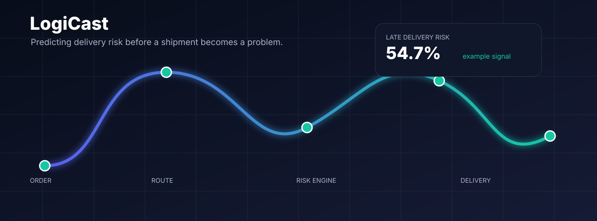

<div align="center">


### Predict delivery risk before it becomes a problem.

**LogiCast** is a machine-learning project for predicting whether a supply-chain order is at risk of late delivery using information available when the order is placed.

<p>
  
  
  
  
</p>

</div>

<p align="center">
  
</p>

---

## 🚚 What is LogiCast?

Late deliveries are rarely just a logistics problem. They can create customer dissatisfaction, operational bottlenecks, additional shipping costs, and unpredictable inventory movement.

**LogiCast** is being built around a simple question:

> **Can we identify an order's risk of late delivery before the shipment actually happens?**

Instead of relying on information that only becomes available after delivery, LogiCast is designed around the **order-placement prediction point**. The initial feature set uses shipment configuration, order timing, product details, customer segment, and geographic/market context.

The current project milestone establishes a clean, leakage-aware and chronologically evaluated dataset that can be used for the next stage: model benchmarking and risk prediction.

---

## 🎯 Objective

Build a scalable machine-learning pipeline that can:

1. Accept information available when an order is placed.
2. Estimate the probability of late delivery.
3. Identify the factors associated with delivery risk.
4. Eventually expose the prediction through an API or operational dashboard.
5. Help logistics teams prioritize potentially risky orders before delays occur.

---

## 📊 Dataset

LogiCast currently uses the **DataCo Smart Supply Chain for Big Data Analysis** dataset.

### Dataset snapshot

| Metric | Value |
|---|---:|
| Raw orders | **180,519** |
| Cleaned orders | **180,519** |
| Initial model features | **17** |
| Training rows | **144,415** |
| Testing rows | **36,104** |
| Encoded features | **1,327** |
| Missing values after preprocessing | **0** |
| Target classes | **0 / 1** |

### Target

`Late_delivery_risk`

- `0` → order is not classified as late-risk
- `1` → order is classified as late-risk

The target distribution remains stable across the chronological split:

| Split | No Risk | Late Risk |
|---|---:|---:|
| Train | 45.13% | 54.87% |
| Test | 45.34% | 54.66% |

---

## 🧠 Prediction Design

A key design decision in LogiCast is **preventing target leakage**.

The model should not learn from information that would only become known after the delivery process has already progressed.

### Removed leakage / post-outcome information

Examples include:

- `Delivery Status`
- `Days for shipping (real)`
- `shipping date (DateOrders)`
- `Order Status`

Personal information and unnecessary identifiers were also removed.

This makes the project closer to a real operational prediction problem rather than simply predicting an outcome from information that already reveals it.

---

## 🧩 Current Feature Set

The first LogiCast model uses 17 features:

### Shipment configuration
- `Type`
- `Shipping Mode`
- `Days for shipment (scheduled)`

### Order timing
- `Order_Month`
- `Order_DayOfWeek`
- `Order_Day`

### Product & transaction context
- `Category Name`
- `Department Name`
- `Order Item Product Price`
- `Order Item Quantity`
- `Order Item Discount`
- `Order Item Discount Rate`

### Customer segment
- `Customer Segment`

### Geographic & market context
- `Market`
- `Order Region`
- `Order Country`
- `Order State`

---

## ⏳ Why a Chronological Split?

Randomly splitting historical logistics data can make evaluation unrealistically optimistic because information from the future can be mixed into the training set.

LogiCast instead sorts orders chronologically and uses:

```text
Past orders  ───────────────► Training
                                  │
                                  ▼
Future orders ──────────────► Testing
```

### Current split

**Training**

`2015-01-01 → 2017-04-22`

**Testing**

`2017-04-22 → 2018-01-31`

This better represents the eventual production scenario:

> Train on historical orders → predict risk for future orders.

---

## ⚙️ Preprocessing Pipeline

LogiCast uses a reusable `scikit-learn` preprocessing pipeline.

### Numerical features

1. Missing values → median imputation
2. Standardization → `StandardScaler`

### Categorical features

1. Missing values → most-frequent imputation
2. One-hot encoding
3. `handle_unknown="ignore"`

The preprocessor is fitted **only on the training data** and then applied to the test data.

```python
X_train_processed = preprocessor.fit_transform(X_train)
X_test_processed = preprocessor.transform(X_test)
```

Result:

```text
Original training features : 17
Processed training features: 1,327

Original testing features  : 17
Processed testing features : 1,327
```

No missing values remain after preprocessing.

---

## 🏗️ Project Structure

```text
LogiCast/
│
├── data/
│   ├── raw/
│   │   └── DataCoSupplyChainDataset.csv
│   │
│   └── processed/
│       ├── supply_chain_cleaned.csv
│       └── feature_columns.txt
│
├── notebooks/
│   ├── 01_data_loading.ipynb
│   ├── 02_preprocessing.ipynb
│   └── 03_baseline_models.ipynb
│
├── src/
│   ├── data/
│   ├── features/
│   └── models/
│       ├── preprocessor.joblib
│       └── processed_feature_names.txt
│
├── reports/
│   └── figures/
│
├── README.md
└── requirements.txt
```

---

## 🔬 Current Pipeline

```text
                 ┌──────────────────────┐
                 │  Raw Supply Chain    │
                 │       Data           │
                 └──────────┬───────────┘
                            │
                            ▼
                 ┌──────────────────────┐
                 │ Data Cleaning &      │
                 │ Leakage Prevention   │
                 └──────────┬───────────┘
                            │
                            ▼
                 ┌──────────────────────┐
                 │ Feature Engineering  │
                 │ Time + Order Context │
                 └──────────┬───────────┘
                            │
                            ▼
                 ┌──────────────────────┐
                 │ Chronological Split  │
                 │       80 / 20        │
                 └──────────┬───────────┘
                            │
                    ┌───────┴───────┐
                    ▼               ▼
              ┌──────────┐    ┌──────────┐
              │  Train   │    │   Test   │
              └────┬─────┘    └────┬─────┘
                   │               │
                   ▼               ▼
              ┌────────────────────────┐
              │ Reusable Preprocessing │
              │ Impute + Encode + Scale│
              └────────────┬───────────┘
                           │
                           ▼
                 ┌──────────────────────┐
                 │   ML Risk Models     │
                 │   (Next Milestone)   │
                 └──────────────────────┘
```

---

## 🛡️ Data & Modeling Principles

LogiCast follows several principles intended to make the eventual prediction system more realistic:

- **Prediction-time discipline** — only use information intended to be available at order placement.
- **Leakage prevention** — exclude direct or post-outcome fields.
- **Chronological evaluation** — evaluate future-like data rather than relying only on random splits.
- **Reusable preprocessing** — save the fitted transformer for consistent inference.
- **Unknown-category tolerance** — unseen categories do not break the pipeline.
- **Privacy-aware modeling** — remove customer-identifying information from the model inputs.

---

## 📦 Generated Artifacts

The preprocessing stage produces reusable artifacts:

```text
data/processed/supply_chain_cleaned.csv
data/processed/feature_columns.txt

src/models/preprocessor.joblib
src/models/processed_feature_names.txt
```

These artifacts allow future model-training and inference code to use the **same preprocessing logic** without rebuilding it manually.

---

## 🗺️ Roadmap

### Phase 1 — Data Foundation
- [x] Load and inspect dataset
- [x] Clean missing-value representations
- [x] Remove duplicates
- [x] Remove PII
- [x] Prevent target leakage
- [x] Engineer order-time features
- [x] Create chronological train/test split
- [x] Build reusable preprocessing pipeline
- [x] Save preprocessing artifacts

### Phase 2 — Model Benchmarking
- [ ] Dummy Classifier baseline
- [ ] Logistic Regression
- [ ] Random Forest
- [ ] XGBoost
- [ ] Compare ROC-AUC
- [ ] Compare PR-AUC
- [ ] Precision / Recall analysis
- [ ] Confusion matrices
- [ ] Select the strongest baseline model

### Phase 3 — Explainability
- [ ] Feature importance
- [ ] SHAP analysis
- [ ] Risk-driver analysis
- [ ] Error analysis

### Phase 4 — LogiCast Risk Engine
- [ ] Prediction service
- [ ] Probability-based risk score
- [ ] Low / Medium / High risk bands
- [ ] REST API
- [ ] Batch prediction

### Phase 5 — Product Layer
- [ ] Logistics dashboard
- [ ] Order-level risk monitoring
- [ ] Risk filtering and search
- [ ] Operational alerts
- [ ] Model monitoring
- [ ] Deployment

---

## 🧪 Next Step

The preprocessing foundation is complete.

The next notebook is:

```text
03_baseline_models.ipynb
```

The first experiments will establish a meaningful baseline using:

```text
Dummy Classifier
       ↓
Logistic Regression
       ↓
Random Forest
       ↓
XGBoost
       ↓
Model Comparison
```

The goal is not simply to maximize accuracy. Because late-delivery prediction is a risk problem, **ROC-AUC, PR-AUC, precision, recall and the cost of false negatives** will all matter.

---

## 👨‍💻 Author

**Kushagra Maheshwari**

Built as a machine-learning and product-oriented exploration of predictive supply-chain intelligence.

---

<div align="center">

### LogiCast

**Predict earlier. Act faster. Deliver better.**

</div>
